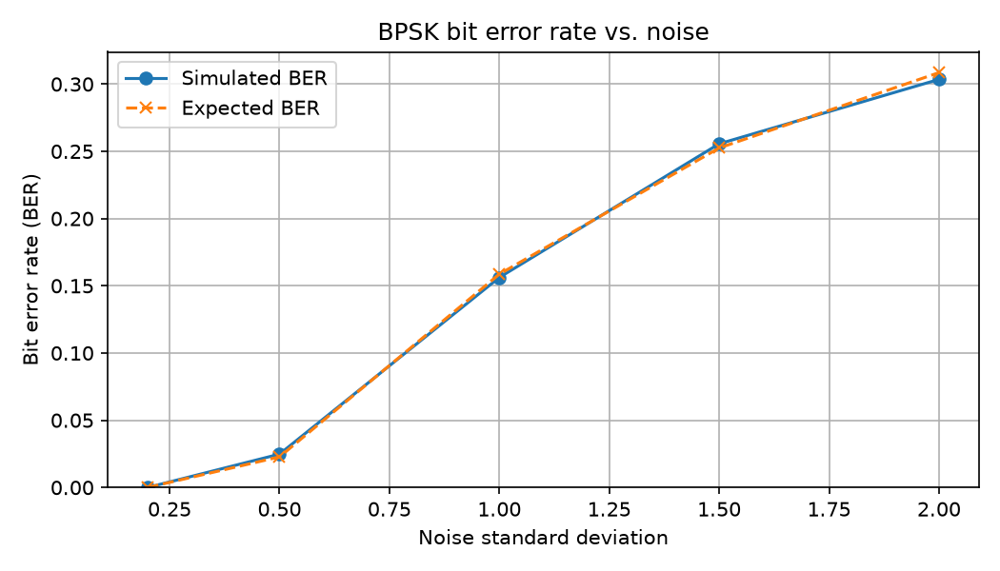

# BPSK Signal Simulation

A Python project that simulates binary phase-shift keying (BPSK) over a noisy channel. It generates random bits, maps them to BPSK symbols, adds Gaussian noise, recovers the bits, and measures the bit error rate (BER). It then compares the simulated BER with the expected BER for the same simplified channel model.

This project is a learning exercise in digital communication, reproducible simulation, object-oriented Python, and basic verification—not an SDR measurement or a full wireless physical-layer implementation.

## Results



Each point on the simulated curve is based on 10,000 transmitted bits. Both curves rise as the noise standard deviation increases, and the simulated results are close to the model's predictions.

| Noise standard deviation | Simulated BER | Expected BER |
| ---: | ---: | ---: |
| 0.2 | 0.000000 | < 0.000001 |
| 0.5 | 0.024800 | 0.022750 |
| 1.0 | 0.156200 | 0.158655 |
| 1.5 | 0.255600 | 0.252493 |
| 2.0 | 0.303500 | 0.308538 |

These simulated values come from a run with a fixed random seed and 10,000 bits per noise level. At noise standard deviation 0.2, zero errors were observed in this run; that does not mean the true error probability is exactly zero.

## How the simulation works

The transmitter maps each bit to a symbol:

| Input bit | Transmitted symbol |
| --- | ---: |
| 0 | -1 |
| 1 | +1 |

The channel adds independently generated, zero-mean Gaussian noise to each symbol:

```text
received symbol = transmitted symbol + noise
```

The receiver decides `0` when the received value is negative and `1` when it is zero or positive. BER is the number of incorrectly decoded bits divided by the number of transmitted bits.

For this specific model, with symbol values `-1` and `+1`, noise standard deviation `sigma > 0`, and a zero decision threshold, the predicted error probability is:

```text
Expected BER = 0.5 × erfc(1 / (sqrt(2) × sigma))
```

`main.py` calculates this expected value using Python's `math.erfc` and compares it with the simulated result. The x-axis of the plot is **noise standard deviation**, not signal-to-noise ratio (SNR).

## Run locally

Requires Python 3 and the packages listed in `requirements.txt`. From the project root, on macOS or Linux:

```bash
python3 -m venv .venv
source .venv/bin/activate
python -m pip install -r requirements.txt
python main.py
```

The script prints a 20-bit example, reports BER at five noise levels using 10,000 bits per level, displays the comparison plot, and saves `ber_simulated_vs_expected.png` in the project root.

## Run the tests

From the project root, with the virtual environment active:

```bash
python -m unittest -v test_simulation
```

The four unit tests check bit generation, BPSK mapping, zero-noise transmission, and receiver decisions at the zero threshold.

## Project structure

```text
.
├── main.py                         # Runs the demonstration and BER experiment
├── simulation.py                   # Transmitter, noisy channel, and receiver classes
├── plotting.py                     # Draws and saves the BER comparison plot
├── test_simulation.py              # Component unit tests
├── requirements.txt                # Python dependencies
└── ber_simulated_vs_expected.png   # Result shown above
```

## Scope and limitations

- This is a real-valued, symbol-level simulation, not a generated RF waveform or an over-the-air measurement.
- The channel adds Gaussian noise only; it does not model fading, interference, synchronization errors, or hardware effects.
- The simulation uses a finite number of bits, so measured BER can differ slightly from the expected probability.
- It does not use HermesPy or claim to reproduce a published joint communication-and-sensing result.
